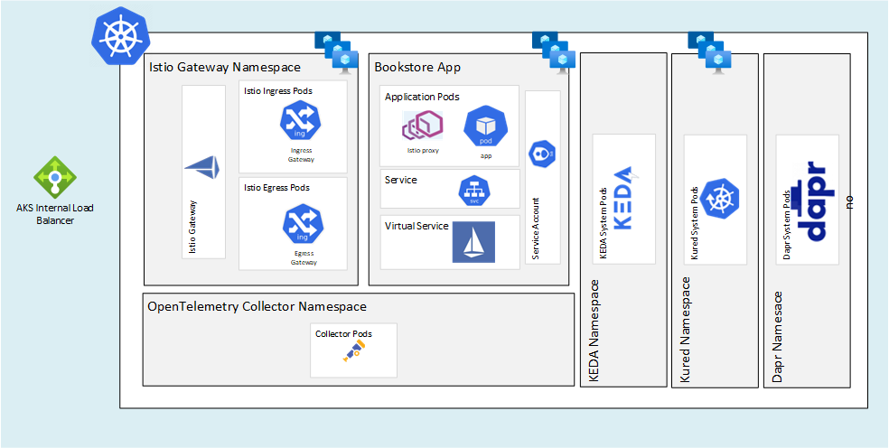

# Overview

This repository is covers how to stand up a public (but secure) AKS/Kubernetes cluster with Istio. This code is an opiniated method of applying the standards into an end to end solution using Terraform, Flux and Istio configuration.

## Cluster Design 
* Public cluster with Azure AD RBAC enabled and API Server IP Restricted
* 2 node pools with Azure Linux as the Node OS
    * One system node pool
    * One node pool for applications 
* Azure Managed Service Mesh with Internal Ingress Controller
* [Azure CNI Overlay](https://learn.microsoft.com/en-us/azure/aks/azure-cni-overlay) network with [Cilium Dataplane](https://learn.microsoft.com/en-us/azure/aks/azure-cni-powered-by-cilium)
* Cluster Identity - User Managed Identity
* Kubelet Identity - User Managed Identity
* [Node Image OS Updater](https://learn.microsoft.com/en-us/azure/aks/node-image-upgrade)
* [Maintenace Schedule Setup](https://learn.microsoft.com/en-us/azure/aks/planned-maintenance) for weekly updates
* Integrated with Azure Monitor Workspaces/Prometheus and Azure Managed Grafana Service

## Cluster Extensions
* Flux
* Dapr
* KEDA

## Extensions Added by Flux
* Knative
* KubeCost 
* Kured

### Diagram


# Prerequisites 
_Use DevContainer with Github Codespaces_
* Fork then Clone the git repository to your own GitHub account
* Azure subscription with Owner access permissions
* [AKS Preview Features](https://github.com/briandenicola/kubernetes-cluster-setup/blob/main/scripts/aks-preview-features.sh)
   * Script requires  `/usr/bin/watch` which is not part of the default bash shell on macos.
   * Run `brew install watch` to install on macos
* [Azure Cli](https://learn.microsoft.com/en-us/cli/azure/install-azure-cli)
* [Terraform](https://developer.hashicorp.com/terraform/downloads)
* [flux](https://fluxcd.io/flux/installation/)
* [Taskfile](https://taskfile.dev/installation)
* A TLS Certificate in TLS format
  
# Deployment - Default Region (South Central)
```bash
vi .env
  CERT_PFX_PASS=
  CERT_PATH=
az login 
task up 
```
> **_NOTE:_** Task will automatically update [zipkin](https://github.com/briandenicola/aks-with-istio/blob/main/clusters/common/istio/configuration/zipkin.tmpl) with the proper App Insights workspace ID. Otherwise this will have be to manually updated.

## Deployment - Alternate Region
```bash
vi .env
  CERT_PFX_PASS=
  CERT_PATH=
az login 
task up -- northcentralus
```

## Sample Run
```
$ task up
task: [init] terraform -chdir=./infrastructure workspace new southcentralus || true
...
task: [init] terraform -chdir=./infrastructure workspace select southcentralus
task: [init] terraform -chdir=./infrastructure init
task: [apply] terraform -chdir=./infrastructure apply -auto-approve -var "region=southcentralus"
data.http.myip: Reading...
data.http.myip: Read complete after 0s [id=http://checkip.amazonaws.com/]
data.azurerm_client_config.current: Reading...
data.azurerm_subscription.current: Reading...
data.azurerm_client_config.current: Read complete after 0s 
...
Plan: 41 to add, 0 to change, 0 to destroy.

Changes to Outputs:
  + AI_INSTRUMENTATION_KEY = (sensitive value)
  + AKS_CLUSTER_NAME       = (known after apply)
  + AKS_RESOURCE_GROUP     = (known after apply)
random_integer.services_cidr: Creating...
random_pet.this: Creating...
random_integer.pod_cidr: Creating...
random_integer.vnet_cidr: Creating...
random_id.this: Creating...
random_integer.pod_cidr: Creation complete after 0s [id=102]
random_integer.vnet_cidr: Creation complete after 0s [id=58]
random_id.this: Creation complete after 0s [id=C3Y]
random_pet.this: Creation complete after 0s [id=beagle]
random_integer.services_cidr: Creation complete after 0s [id=70]
azurerm_resource_group.this: Creating...
....
Apply complete! Resources: 4 added, 1 changed, 0 destroyed.

Outputs:

AI_INSTRUMENTATION_KEY = <sensitive>
AKS_CLUSTER_NAME = "drum-271-aks"
AKS_RESOURCE_GROUP = "drum-271_rg"
task: [creds] az aks get-credentials -g drum-271_rg -n drum-271-aks --overwrite-existing
The behavior of this command has been altered by the following extension: aks-preview
Merged "drum-271-aks" as current context in /home/admin/.kube/config
task: [creds] kubelogin convert-kubeconfig -l azurecli
task: [appinsights] export AI_INSTRUMENTATION_KEY=b710e469-894b-45c4-b0d3-ce331c7d7be0 ; envsubst < clusters/common/istio/configuration/zipkin.tmpl > clusters/common/istio/configuration/zipkin.yaml
task: [appinsights] git add clusters/common/istio/configuration/zipkin.yaml
task: [appinsights] git commit -m "Updated AI_INSTRUMENTATION_KEY value"
[main 9c6615b] Updated AI_INSTRUMENTATION_KEY value
 1 file changed, 110 insertions(+)
 create mode 100644 clusters/common/istio/configuration/zipkin.yaml
task: [appinsights] git push
Enumerating objects: 12, done.
Counting objects: 100% (12/12), done.
Delta compression using up to 8 threads
Compressing objects: 100% (7/7), done.
Writing objects: 100% (7/7), 1.34 KiB | 1.34 MiB/s, done.
Total 7 (delta 3), reused 0 (delta 0)
remote: Resolving deltas: 100% (3/3), completed with 3 local objects.
remote: This repository moved. Please use the new location:
remote:   git@github.com:sampleuser/aks-with-istio.git

```

# Validate 
```bash
task cluster
task pods 
```

## Sample Ouput
```
$ task cluster
task: [cluster] kubectl config use-context drum-271-aks
task: [cluster] kubectl config use-context drum-271-aks
Switched to context "drum-271-aks".
task: [cluster] az aks show -n drum-271-aks -g drum-271_rg -o table
The behavior of this command has been altered by the following extension: aks-preview
Name          Location        ResourceGroup    KubernetesVersion    CurrentKubernetesVersion    ProvisioningState    Fqdn
------------  --------------  ---------------  -------------------  --------------------------  -------------------  --------------------------------------------------
drum-271-aks  southcentralus  drum-271_rg      1.27.1               1.27.1                      Succeeded            drum-271-aks-n7hb3lze.hcp.southcentralus.azmk8s.io

task: [cluster] az aks nodepool list --cluster-name drum-271-aks -g drum-271_rg -o table
The behavior of this command has been altered by the following extension: aks-preview
Name    OsType    VmSize             Count    MaxPods    ProvisioningState    Mode
------  --------  -----------------  -------  ---------  -------------------  ------
apps    Linux     Standard_D4ads_v5  3        250        Succeeded            User
system  Linux     Standard_D4ads_v5  3        60         Succeeded            System

task: [cluster] kubectl get nodes -o wide -L kubernetes.azure.com/node-image-version
NAME                             STATUS   ROLES   AGE   VERSION   INTERNAL-IP   EXTERNAL-IP   OS-IMAGE            KERNEL-VERSION     CONTAINER-RUNTIME     NODE-IMAGE-VERSION
aks-apps-60142216-vmss000000     Ready    agent   18m   v1.27.1   10.135.2.10   <none>        CBL-Mariner/Linux   5.15.116.1-2.cm2   containerd://1.6.18   AKSCBLMariner-V2gen2-202308.01.0
aks-apps-60142216-vmss000001     Ready    agent   18m   v1.27.1   10.135.2.8    <none>        CBL-Mariner/Linux   5.15.116.1-2.cm2   containerd://1.6.18   AKSCBLMariner-V2gen2-202308.01.0
aks-apps-60142216-vmss000003     Ready    agent   18m   v1.27.1   10.135.2.11   <none>        CBL-Mariner/Linux   5.15.116.1-2.cm2   containerd://1.6.18   AKSCBLMariner-V2gen2-202308.01.0
aks-system-15785595-vmss000000   Ready    agent   34m   v1.27.1   10.135.2.6    <none>        CBL-Mariner/Linux   5.15.116.1-2.cm2   containerd://1.6.18   AKSCBLMariner-V2gen2-202308.01.0
aks-system-15785595-vmss000001   Ready    agent   34m   v1.27.1   10.135.2.4    <none>        CBL-Mariner/Linux   5.15.116.1-2.cm2   containerd://1.6.18   AKSCBLMariner-V2gen2-202308.01.0
aks-system-15785595-vmss000003   Ready    agent   35m   v1.27.1   10.135.2.7    <none>        CBL-Mariner/Linux   5.15.116.1-2.cm2   containerd://1.6.18   AKSCBLMariner-V2gen2-202308.01.0
task: [cluster] kubectl get --raw='/readyz?verbose'
[+]ping ok
[+]log ok
[+]etcd ok
[+]etcd-readiness ok
[+]informer-sync ok
[+]poststarthook/start-kube-apiserver-admission-initializer ok
[+]poststarthook/generic-apiserver-start-informers ok
[+]poststarthook/priority-and-fairness-config-consumer ok
...
[+]poststarthook/apiservice-openapi-controller ok
[+]poststarthook/apiservice-openapiv3-controller ok
[+]poststarthook/apiservice-discovery-controller ok
[+]shutdown ok
readyz check passed

$ task pods
task: [pods] kubectl -n aks-istio-ingress get pods,services,deployments
NAME                                   READY   STATUS    RESTARTS   AGE
pod/default-backend-6f498f47dc-k4sqc   2/2     Running   0          2m53s

NAME                          TYPE        CLUSTER-IP     EXTERNAL-IP   PORT(S)   AGE
service/default-backend-svc   ClusterIP   100.70.84.44   <none>        80/TCP    2m53s

NAME                              READY   UP-TO-DATE   AVAILABLE   AGE
deployment.apps/default-backend   1/1     1            1           2m53s
task: [pods] kubectl -n aks-istio-ingress get pods,services,deployments
NAME                                                     READY   STATUS    RESTARTS   AGE
pod/aks-istio-ingressgateway-internal-579c5d8d4b-hpwjs   1/1     Running   0          24m
pod/aks-istio-ingressgateway-internal-579c5d8d4b-mgs67   1/1     Running   0          24m

NAME                                        TYPE           CLUSTER-IP       EXTERNAL-IP   PORT(S)                                      AGE
service/aks-istio-ingressgateway-internal   LoadBalancer   100.70.240.168   10.135.2.5    15021:30275/TCP,80:31960/TCP,443:31402/TCP   24m

NAME                                                READY   UP-TO-DATE   AVAILABLE   AGE
deployment.apps/aks-istio-ingressgateway-internal   2/2     2            2           24m
task: [pods] kubectl -n aks-istio-system get pods,services,deployments
NAME                                   READY   STATUS    RESTARTS   AGE
pod/istiod-asm-1-17-5c577b879b-2k979   1/1     Running   0          24m
pod/istiod-asm-1-17-5c577b879b-6lckm   1/1     Running   0          24m

NAME                            TYPE        CLUSTER-IP      EXTERNAL-IP   PORT(S)                                 AGE
service/istiod-asm-1-17         ClusterIP   100.70.69.53    <none>        15010/TCP,15012/TCP,443/TCP,15014/TCP   24m
service/knative-local-gateway   ClusterIP   100.70.43.120   <none>        80/TCP                                  2m51s

NAME                              READY   UP-TO-DATE   AVAILABLE   AGE
deployment.apps/istiod-asm-1-17   2/2     2            2           24m
task: [pods] kubectl -n knative-serving get pods,services,deployments
NAME                                         READY   STATUS    RESTARTS   AGE
pod/activator-5846f4cff6-tm2kn               1/1     Running   0          2m52s
pod/autoscaler-6878b897db-46qrf              1/1     Running   0          2m52s
pod/controller-84bd779f54-ph2hw              1/1     Running   0          2m52s
pod/domain-mapping-7c69c4bf7-87td2           1/1     Running   0          2m52s
pod/domainmapping-webhook-579fb45448-mk2n5   1/1     Running   0          2m51s
pod/net-istio-controller-7888cf8dfc-9pgkg    1/1     Running   0          2m51s
pod/net-istio-webhook-6569bdd678-f7nrp       1/1     Running   0          2m51s
pod/webhook-5c95f98fb5-lxq9f                 1/1     Running   0          2m51s

NAME                                 TYPE        CLUSTER-IP       EXTERNAL-IP   PORT(S)                                   AGE
service/activator-service            ClusterIP   100.70.181.113   <none>        9090/TCP,8008/TCP,80/TCP,81/TCP,443/TCP   2m52s
service/autoscaler                   ClusterIP   100.70.179.46    <none>        9090/TCP,8008/TCP,8080/TCP                2m52s
service/autoscaler-bucket-00-of-01   ClusterIP   100.70.58.91     <none>        8080/TCP                                  2m47s
service/controller                   ClusterIP   100.70.66.102    <none>        9090/TCP,8008/TCP                         2m52s
service/domainmapping-webhook        ClusterIP   100.70.78.51     <none>        9090/TCP,8008/TCP,443/TCP                 2m52s
service/net-istio-webhook            ClusterIP   100.70.88.158    <none>        9090/TCP,8008/TCP,443/TCP                 2m52s
service/webhook                      ClusterIP   100.70.254.180   <none>        9090/TCP,8008/TCP,443/TCP                 2m52s

NAME                                    READY   UP-TO-DATE   AVAILABLE   AGE
deployment.apps/activator               1/1     1            1           2m52s
deployment.apps/autoscaler              1/1     1            1           2m52s
deployment.apps/controller              1/1     1            1           2m52s
deployment.apps/domain-mapping          1/1     1            1           2m52s
deployment.apps/domainmapping-webhook   1/1     1            1           2m52s
deployment.apps/net-istio-controller    1/1     1            1           2m52s
deployment.apps/net-istio-webhook       1/1     1            1           2m51s
deployment.apps/webhook                 1/1     1            1           2m51s
task: [pods] kubectl -n apps get pods,services,deployments
NAME                           READY   STATUS    RESTARTS   AGE
pod/httpbin-6d7f66fbdd-8kwkv   2/2     Running   0          2m55s
pod/httpbin-6d7f66fbdd-drqr5   2/2     Running   0          2m55s
pod/httpbin-6d7f66fbdd-lr5ll   2/2     Running   0          2m55s

NAME                 TYPE        CLUSTER-IP     EXTERNAL-IP   PORT(S)   AGE
service/httpbinsvc   ClusterIP   100.70.11.75   <none>        80/TCP    2m55s

NAME                      READY   UP-TO-DATE   AVAILABLE   AGE
deployment.apps/httpbin   3/3     3            3           2m55s
task: [pods] kubectl -n bookstore get pods,services,deployments
NAME                                  READY   STATUS    RESTARTS   AGE
pod/details-v1-6448f9bdc8-962mw       2/2     Running   0          2m55s
pod/productpage-v1-65b8499c86-snbhz   2/2     Running   0          2m55s
pod/ratings-v1-56687d6766-7ww87       2/2     Running   0          2m55s
pod/reviews-v1-5c785db578-9tn6z       2/2     Running   0          2m55s
pod/reviews-v2-6d8c88978b-rw76x       2/2     Running   0          2m55s
pod/reviews-v3-678b968858-r5rqw       2/2     Running   0          2m55s

NAME                  TYPE        CLUSTER-IP       EXTERNAL-IP   PORT(S)    AGE
service/details       ClusterIP   100.70.202.241   <none>        9080/TCP   2m56s
service/productpage   ClusterIP   100.70.61.243    <none>        9080/TCP   2m56s
service/ratings       ClusterIP   100.70.94.134    <none>        9080/TCP   2m56s
service/reviews       ClusterIP   100.70.175.49    <none>        9080/TCP   2m56s

NAME                             READY   UP-TO-DATE   AVAILABLE   AGE
deployment.apps/details-v1       1/1     1            1           2m56s
deployment.apps/productpage-v1   1/1     1            1           2m56s
deployment.apps/ratings-v1       1/1     1            1           2m56s
deployment.apps/reviews-v1       1/1     1            1           2m56s
deployment.apps/reviews-v2       1/1     1            1           2m56s
deployment.apps/reviews-v3       1/1     1            1           2m56s
task: [pods] kubectl -n kube-system get pods,services,deployments
NAME                                                       READY   STATUS    RESTARTS       AGE
pod/aks-secrets-store-csi-driver-9c2vs                     3/3     Running   0              26m
pod/aks-secrets-store-csi-driver-hmrgw                     3/3     Running   0              27m
pod/aks-secrets-store-csi-driver-jcgsk                     3/3     Running   0              10m
....
pod/microsoft-defender-publisher-ds-tm6wb                  1/1     Running   0              10m

NAME                                         TYPE        CLUSTER-IP       EXTERNAL-IP   PORT(S)            AGE
service/ama-metrics-ksm                      ClusterIP   100.70.169.25    <none>        8080/TCP           25m
service/azure-policy-webhook-service         ClusterIP   100.70.5.120     <none>        443/TCP            27m
service/azure-wi-webhook-webhook-service     ClusterIP   100.70.150.82    <none>        443/TCP            27m
service/extension-agent-metrics-service      ClusterIP   100.70.135.112   <none>        8443/TCP           8m32s
service/extension-operator-metrics-service   ClusterIP   100.70.8.82      <none>        8443/TCP           8m32s
service/kappie-svc                           ClusterIP   100.70.210.155   <none>        10093/TCP          20m
service/keda-admission-webhooks              ClusterIP   100.70.207.25    <none>        443/TCP            25m
service/keda-operator                        ClusterIP   100.70.92.15     <none>        9666/TCP           25m
service/keda-operator-metrics-apiserver      ClusterIP   100.70.24.77     <none>        443/TCP,8080/TCP   25m
service/kube-dns                             ClusterIP   100.70.0.10      <none>        53/UDP,53/TCP      27m
service/metrics-server                       ClusterIP   100.70.50.168    <none>        443/TCP            27m

NAME                                                  READY   UP-TO-DATE   AVAILABLE   AGE
deployment.apps/ama-logs-rs                           1/1     1            1           25m
deployment.apps/ama-metrics                           1/1     1            1           25m
deployment.apps/ama-metrics-ksm                       1/1     1            1           25m
deployment.apps/azure-policy                          1/1     1            1           27m
deployment.apps/azure-policy-webhook                  1/1     1            1           27m
deployment.apps/azure-wi-webhook-controller-manager   2/2     2            2           27m
deployment.apps/coredns                               2/2     2            2           27m
deployment.apps/coredns-autoscaler                    1/1     1            1           27m
deployment.apps/eraser-controller-manager             1/1     1            1           25m
deployment.apps/extension-agent                       1/1     1            1           8m32s
deployment.apps/extension-operator                    1/1     1            1           8m32s
deployment.apps/keda-admission-webhooks               2/2     2            2           25m
deployment.apps/keda-operator                         2/2     2            2           25m
deployment.apps/keda-operator-metrics-apiserver       2/2     2            2           25m
deployment.apps/konnectivity-agent                    2/2     2            2           27m
deployment.apps/metrics-server                        2/2     2            2           27m
deployment.apps/microsoft-defender-collector-misc     1/1     1            1           27m
task: [pods] flux get all
NAME                                    REVISION                SUSPENDED       READY   MESSAGE
gitrepository/aks-flux-extension        main@sha1:9c6615bf      False           True    stored artifact for revision 'main@sha1:9c6615bf'

NAME                            REVISION        SUSPENDED       READY   MESSAGE
helmrepository/kubecost         sha256:f4b43667 False           True    stored artifact: revision 'sha256:f4b43667'
helmrepository/kubereboot       sha256:c8866812 False           True    stored artifact: revision 'sha256:c8866812'

NAME                                    REVISION        SUSPENDED       READY   MESSAGE
helmchart/flux-system-kubecost-release  1.101.3         False           True    pulled 'cost-analyzer' chart with version '1.101.3'
helmchart/flux-system-kured-release     4.0.2           False           True    pulled 'kured' chart with version '4.0.2'

NAME                            REVISION        SUSPENDED       READY   MESSAGE
helmrelease/kubecost-release    1.101.3         False           True    Release reconciliation succeeded
helmrelease/kured-release       4.0.2           False           True    Release reconciliation succeeded

NAME                                            REVISION                SUSPENDED       READY   MESSAGE
kustomization/aks-flux-extension-apps           main@sha1:9c6615bf      False           True    Applied revision: main@sha1:9c6615bf
kustomization/aks-flux-extension-istio-cfg      main@sha1:9c6615bf      False           True    Applied revision: main@sha1:9c6615bf
kustomization/aks-flux-extension-istio-crd      main@sha1:9c6615bf      False           True    Applied revision: main@sha1:9c6615bf
kustomization/aks-flux-extension-istio-gw       main@sha1:9c6615bf      False           True    Applied revision: main@sha1:9c6615bf
kustomization/bookstore-app                     main@sha1:9c6615bf      False           True    Applied revision: main@sha1:9c6615bf
kustomization/httpbin-app                       main@sha1:9c6615bf      False           True    Applied revision: main@sha1:9c6615bf
kustomization/knative                           main@sha1:9c6615bf      False           True    Applied revision: main@sha1:9c6615bf
```

# Clean Up
```bash
task clean
```

